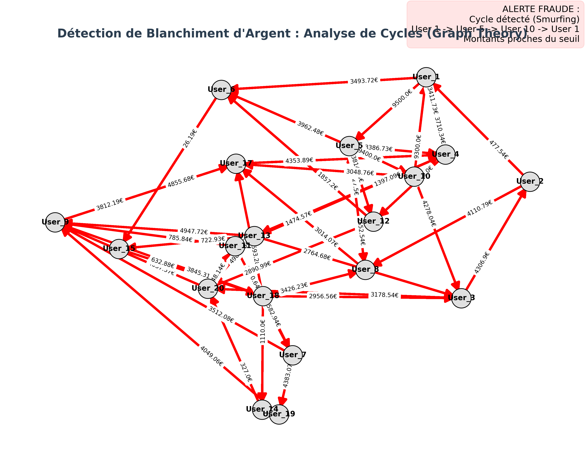

# AML_Smurfing_Detection
# Financial Crime Detection: AML Graph Analysis 🕵️‍♂️💸

## 📋 Project Overview
Traditional methods for detecting money laundering often rely on linear transaction monitoring (Excel/SQL), which struggles to identify complex schemes like **Smurfing** or **Structuring**.

This project utilizes **Graph Theory** and **Python** to model financial flows as a network. By detecting closed cycles (loops) in the transaction graph, we can automatically flag suspicious "round-tripping" patterns often used to launder money or inflate transaction volumes.

## 🚨 Visualization: The "Smurfing" Loop

*(The visualization highlights suspicious circular transactions in **RED**, isolating them from standard background noise.)*

## 🎯 Key Objectives
* **Automate Risk Detection:** Move from manual line-by-line checks to algorithmic pattern recognition.
* **Identify Structural Fraud:** Detect indirect relationships and cycles that evade standard threshold alerts.
* **Visualize Complexity:** Provide clear, actionable graphs for compliance officers and auditors.

## 🛠️ Technical Stack
* **Python**: Core logic.
* **NetworkX**: Graph modeling and cycle detection algorithms (`simple_cycles`).
* **Pandas**: Transaction data structuring.
* **Matplotlib**: Data visualization and risk highlighting.

## 🚀 How it Works
1.  **Data Ingestion:** Loads transaction data (Sender, Receiver, Amount).
2.  **Graph Modeling:** Converts users into **Nodes** and transactions into directed **Edges**.
3.  **Algorithmic Audit:** Scans the network for closed cycles (A → B → C → A).
4.  **Reporting:** Visualizes the network, highlighting nodes involved in suspicious loops.

---
*Project developed by Louis Depoortère to demonstrate the application of Data Science in Banking Compliance & Risk Management.*
